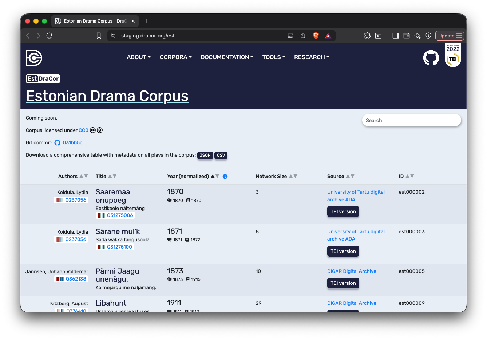

## DigiTS

**Digit**al **T**ext **S**cholarship | Digitekstide uurimiskeskus

- hosted by the Institute of Estonian and General Linguistics
- Horizon Europe _ERA Chair_ grant (#101186601)
- supported by the European Union with €2.5m
- 5 years (March 2025 – February 2030)

## objectives

1. To establish an excellent international research team for DigiTS.
2. To conduct excellent internationally visible research in text-based DH in collaboration with related institutes of UT.
3. To improve the quality and diversity of DH teaching and support at UT, training future DH scholars, helping collaborating units in implementing computational methods for text analysis and educating future GLAM professionals.
4. To contribute to the development and management of the text-based data infrastructure for Estonian LLMs.
5. To ensure sustainability of DigiTS results.

# the team

## project management

- Liina Lindström, Professor of Modern Estonian (PI)
- Maciej Eder, ERA Chair and Visiting Professor of Digital Humanities
- Joshua Wilbur, Lecturer in Digital Linguistics
- Loone Vilumaa, Project Manager

## research team

- Maciej Eder, research group leader
- Kristiina Vaik, Research Fellow in Digital Humanities
- Botond Szemes, Research Fellow in Digital Humanities
- Thiago Dumont Oliveira, Research Fellow in Digital Humanities
- Bhumika Bhattacharya, Junior Researcher
- Sofia Kriuchkova, Junior Researcher
- student assistants (Ove, Manpreet, Olga)

## international advisory board

- Prof. Karina van Dalen-Oskam, Huygens Institute (KNAW) and University of Amsterdam
- Prof. Christof Schöch, University of Trier
- Prof. Ray Siemens, University of Victoria
- Assoc. Prof. Nina Tahmasebi, University of Gothenburg
- Dr. Artjoms Šeļa, Czech Academy of Sciences

## a selection of DigiTS work packages

- Achieving Excellence in Text-Based Digital Humanities
- Digital Humanities Education and Support
- Infrastructure Creation and Stakeholder Engagement
- Dissemination and Communication

## what this means for DH at UT

- rethinking the Center for Digital Humanities ([http://digihum.ut.ee/](http://digihum.ut.ee/)) to expand its offer and make it sustainable
- curriculum improvement and development
    - BA: increased course offerings for BA minor
    - MA: micro-degree in digital methods
    - PhD: training schools, master classes; possibly offering degree in DH
- DH research support and development
    - training opportunities and events
    - regular technical support for students and research staff
- (re)new collaboration within SSH

# activities

## beyond the grant proposal

- ESSLI 2027 to hosted by UT
- estDraCor launched
- AI-teh seminars lanched
- workshop on publication strategies
- Doctoral School in Network Analysis
- further applications: new colleagues will join!

## ESSLI 2027

- 
- 
- 

## estDracor

## AI-teh

- monthly seminar series
- pun intended!
- demonstrations of AI at any stage of research
- so far: inaugural talk by Maciej
- upcoming one: Andres Karjus
- please contribute!

## publication strategy event

- planned as a written Deliverable
- turned to an open seminar
- three invited speakers:
    - Artjoms Šela (_Where to Publish?_)
    - Alan Colin-Arce (_The HSS Commons_)
    - Faraz Forghan Parast (_The Generative Turn_)
- helped to define DigiTS strategy

## doctoral school

- Doctoral School in Network Analysis
- taught by the DigiTS team...
- ... plus Matteo Romanello (ETH Zurich)
- May 6-8, 2026, in Tartu
- over 25 participants
- lectures and hands-on sessions

# advisory board 

## don't miss the fun

- AI-teh: present your work!
- curriculum development: please contribute!
- future phd positions: tell your colleagues!
- ESSLI: suggest a keynote speaker!
- future workshops: consider teaching!
- final conference: spread the word!

## how to find us

- email: [digits@ut.ee](mailto:digits@ut.ee)
- project office: Jakobi 2-426
- research team office: Jakobi 2-131
- homepage: [https://digits.ut.ee/en](https://digits.ut.ee/en)
- Center for Digital Humanities homepage: [http://digihum.ut.ee/](http://digihum.ut.ee/)
- DH center on Facebook: [https://www.facebook.com/profile.php?id=100060669771976](https://www.facebook.com/profile.php?id=100060669771976)
- LinkedIn profile: [https://www.linkedin.com/company/utartu-digits/](https://www.linkedin.com/company/utartu-digits/)
- bluesky profile: [https://bsky.app/profile/digitsut.bsky.social](https://bsky.app/profile/digitsut.bsky.social)

# questions? suggestions?

