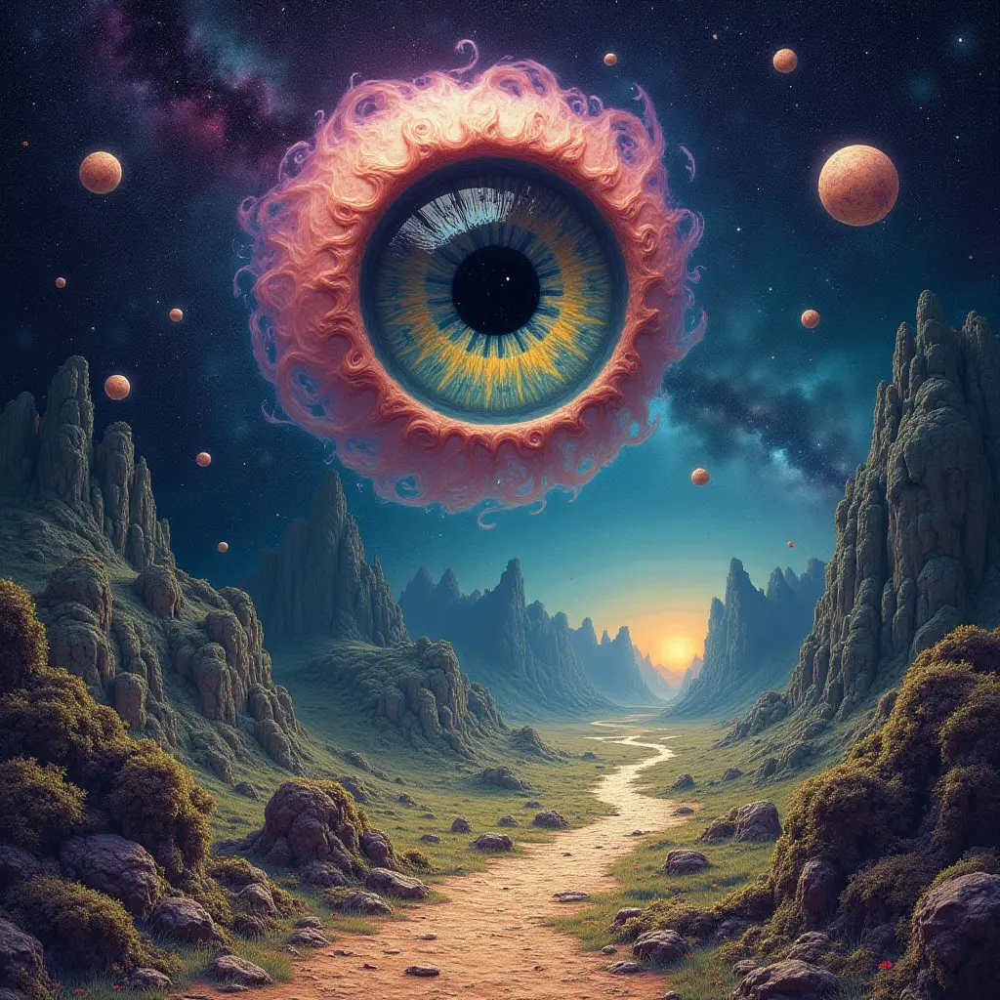
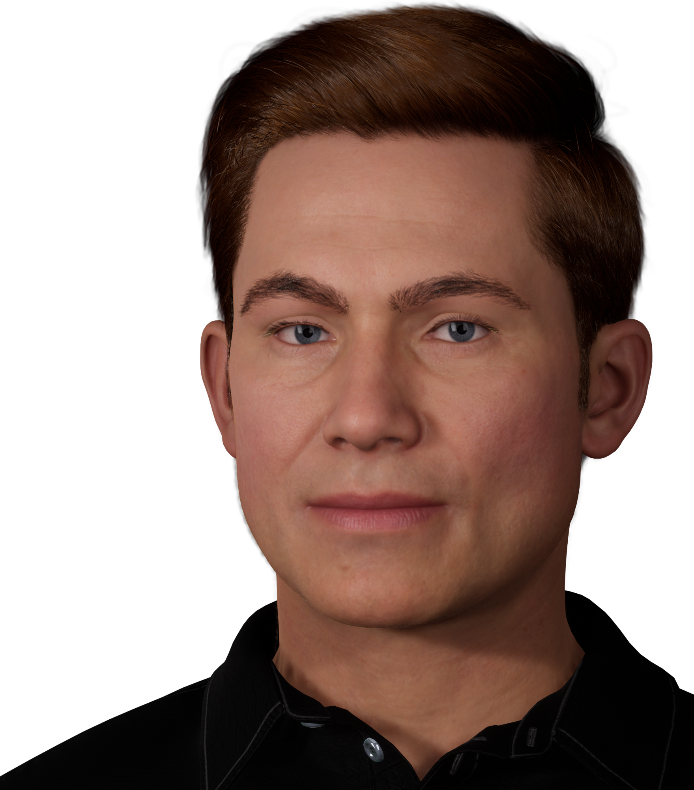
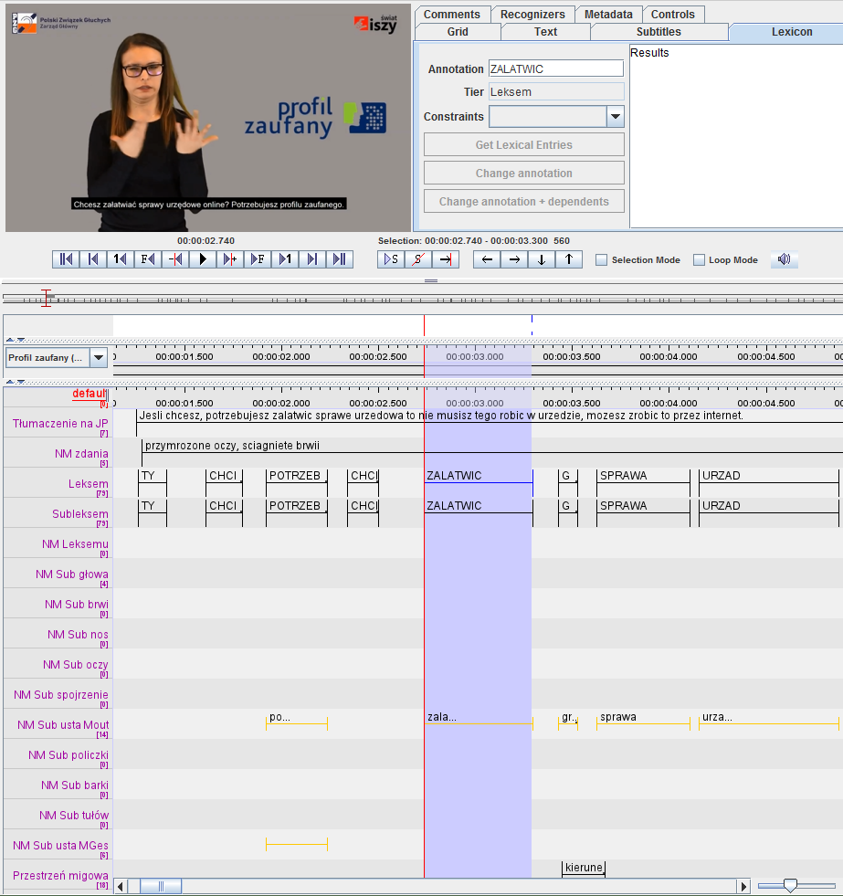
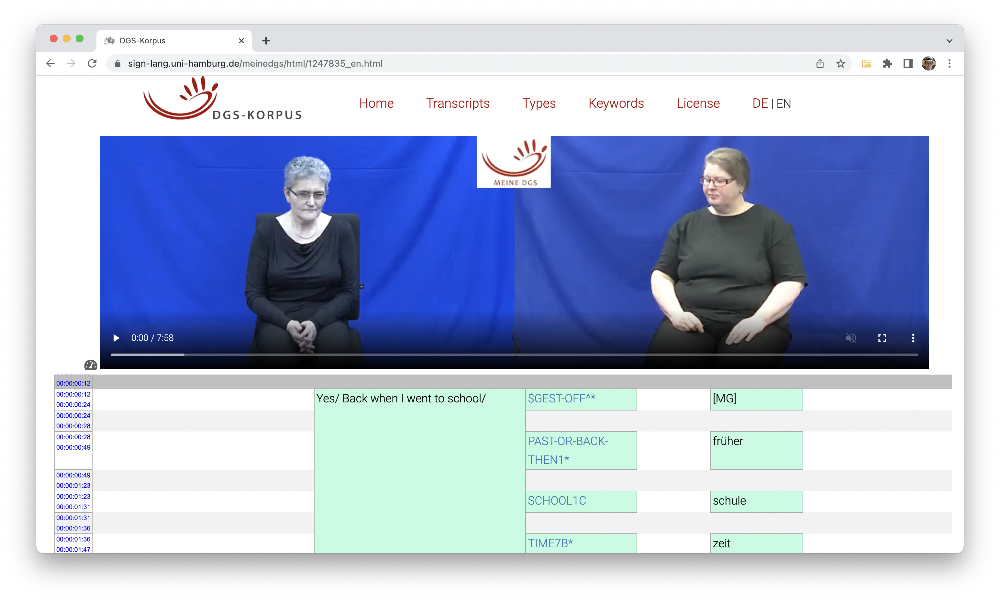
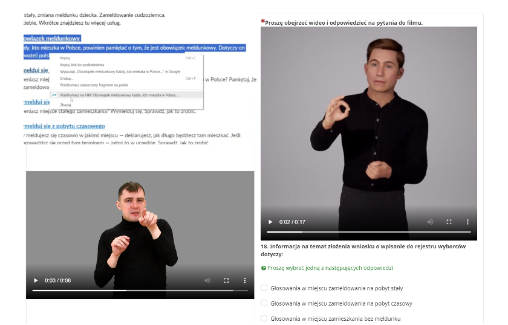
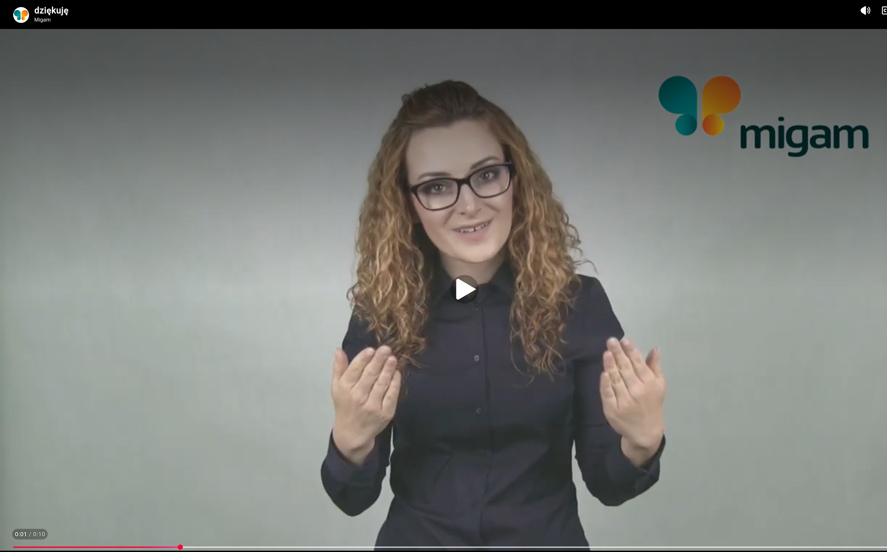

## aim of the project

- to provide a system to automatically translate
    - written language to sign language
    - originally from Polish to PSL (PJM)
    - later: Ukrainian to USL
- capable of translatin any input text
- prototype: public administration domain
- plans: the system used by public institutions


## sign language represented as glosses

A sentence in a phonic language:

- _I will put a book on a table._

Vs. a sentence in a sign language:

- _BOOK, TABLE, PUT-ON_ 

Not only SVO vs. SOV, but also the number of words differ.

(Also, sign languages use space, and have non-manual gestures...)


## traditional models not sufficient

multivariate machine learning (e.g. SVM) fails to map a large feature space:

```{r}
DiagrammeR::grViz("digraph {
  graph [layout = dot, rankdir = TD]
  
  node [shape = rectangle, fixedsize = true, width = 4, style = filled, fillcolor = Beige]      
  box1 [label = 'Why did the banana cross the road?']
  box2 [label = 'mapping function', fillcolor = Linen, width = 2]
  box3 [label = 'Perché la banana ha attraversato la strada?']
  
  # edge definitions with the node IDs
  box1 -> box2 -> box3
  
  }")

```


# the Transformer


## sequence to sequence mapping

```{r}
DiagrammeR::grViz("digraph {
  graph [layout = dot, rankdir = TD]
  
  node [shape = rectangle, fixedsize = true, width = 3, style = filled, fillcolor = Beige]
  box1 [label = 'input text sequence']
  box2 [label = 'TRANSFORMER', fillcolor = Linen, width = 2]
  box3 [label = 'output text sequence']
  
  # edge definitions with the node IDs
  box1 -> box2 -> box3
  
  }")

```


## from audio to text

```{r}
DiagrammeR::grViz("digraph {
  graph [layout = dot, rankdir = TD]
  
  node [shape = rectangle, fixedsize = true, width = 3, style = filled, fillcolor = Beige]      
  box1 [label = 'input audio signal']
  box2 [label = 'TRANSFORMER', fillcolor = Linen, width = 2]
  box3 [label = 'generated text transcription']
  
  # edge definitions with the node IDs
  box1 -> box2-> box3
  
  }")

```


## from text to audio

```{r}
DiagrammeR::grViz("digraph {
  graph [layout = dot, rankdir = TD]
  
  node [shape = rectangle, fixedsize = true, width = 3, style = filled, fillcolor = Beige]      
  box1 [label = 'input written text']
  box2 [label = 'TRANSFORMER', fillcolor = Linen, width = 2]
  box3 [label = 'speech synthesis']
  
  # edge definitions with the node IDs
  box1 -> box2 -> box3
  
  }")

```


## from text to image

```{r}
DiagrammeR::grViz("digraph {
  graph [layout = dot, rankdir = TD]
  
  node [shape = rectangle, fixedsize = true, width = 3, style = filled, fillcolor = Beige]      
  box1 [label = 'text prompt']
  box2 [label = 'TRANSFORMER', fillcolor = Linen, width = 2]
  box3 [label = 'generated picture']
  
  # edge definitions with the node IDs
  box1 -> box2 -> box3
  
  }")

```


## Universe, LSD, Fractal Worlds, Eyes




## machine translation

```{r}
DiagrammeR::grViz("digraph {
  graph [layout = dot, rankdir = TD]
  
  node [shape = rectangle, fixedsize = true, width = 4, style = filled, fillcolor = Beige]      
  box1 [label = 'Why did the banana cross the road?']
  box2 [label = 'TRANSFORMER', fillcolor = Linen, width = 2]
  box3 [label = 'Perché la banana ha attraversato la strada?']
  
  # edge definitions with the node IDs
  box1 -> box2 -> box3
  
  }")

```


# translation to sign language


## avatar modeling with Unreal


## Kristofer the Avatar




## mock-up gesture capturing


## translation as a mapping problem


# solution: avatar-2-pjm


## traditional approach

- Linguistic annotation (POS-tagging, lemmatisation, etc.)
- Word-by-word mapping: Word2Vec (word embeddings) + simple grammatical rules + heurisitcs
- Low quality translation, resembling SJM (System językowo-migowy, artificial sign language)


## the Transformer again

- Deep learning neural network
- Based on the multi-head attention mechanism
- Context-aware
- Suitable for language data (i.e. linear order matters)
- Designed to solve machine translation problems (!)


## data scarcity problem

- AI models have to be fed with lots of data
- In our case, only 800 sentences available
- Three approaches to overcome the issue:
    - Data Augmentation (synthetic datasets to rescue)
    - Transfer Learning (train the model, and then fine-tune)
    - Hybrid approach (input based on traditional translation method)


## 800 manually annotated sentences




## Deutsche Gebärdensprache (DGS)




## overcoming data limitations

Transfer Learning:

- training a model on a big yet general dataset
    - e.g., on 80,000 sentences from DSG corpus
- fine-tuning using a target dataset
    - e.g. the 800 sentences in PJM

Data Augmentation:

- creating a synthetic dataset
- by artificially copying original sentences...
- ... with some random modifications introduced.
- finally, training a model on the augmented dataset
- 

## final solution

- both methods combined
- first step: "traditional" Word2Vec (words embeddings) => preliminary translation
- second step: preliminary translation => Transformer model => final translation


## does it work?



## thank you



