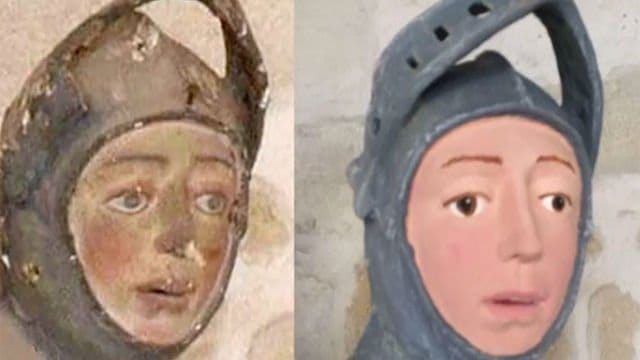
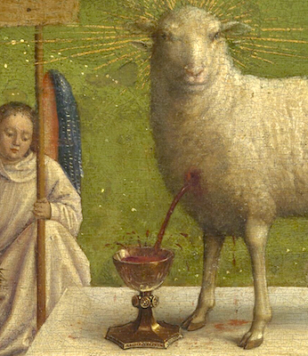
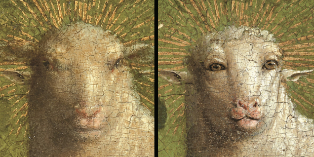

## Wprowadzenie

- Wydane w roku śmierci autora (1584)
- Wydane w jako osobny zbiór poetycki
- Być może pod jakąś kontrolą autorską
- Typowy utwór fragmentaryczny
- Ogromna różnorodność tematyczna


> „_Fraszki_ miały wyposażyć młodą literaturę w języku polskim w dzieło przypominające tematyką i strukturą _Antologię grecką_, bardzo wysoko cenioną […] przez humanistów” (C. Backvis, s. 94)


## Wydanie sejmowe

- uchwała Sejmu z 26 października 1978
- naukowa edycja dzieł wszystkich Kochanowskiego
- w serii Biblioteka Pisarzów Polskich
- edycja dokumentacyjna
    - fototypia
    - odmiany tekstu
    - transkrypcja
    - indeksy wyrazów i form
    - komentarz I, komentarz II
- red. naczelna: Maria Renata Mayenowa


## Wydane tomy

- tom 0: _Wprowadzenie wydawnicze_
- tom I, cz. 1, 3–5: _Psałterz_ (1982–1991) 
- tom II: _Treny_ (1983)
- tom IV: _Pieśni_ (1991)
- tom VII, cz. 2: _Proza_ (1997).
- (oraz: sporo surowych materiałów w szafie IBL PAN)


## Reaktywacja po 30 latach...

- projekt _Dokończenie wydania dzieł wszystkich Jana Kochanowskiego_ 
- red. naczelny: Andrzej Dąbrówka
- finansowany ze środków NPRH
- realizowany od 2012 r.
- oparty na zachowanych archiwaliach
    - tomy gotowe do druku: _Odprawa posłów greckich_
    - tomy w dużej mierze opracowane: _Poematy różne_
    - gotowa transkrypcja, brak komentarza: _Fragmenta_
    - brak jakichkolwiek materiałów: _Fraszki_


## Autorzy nowej edycji _Fraszek_

- Joanna Duska – komentarz językowy 
- Marek Janicki – komentarz historyczny
- Maria Chantry – komentarz neolatynistyczny 
- Teresa Szostek – komentarz klasyczny
- Maciej Eder – transkrypcja tekstu, fototypia, wykaz błędów druku, indeksy wyrazowe, redakcja całości

> pierwotnie: Janusz Pelc, Paulina Buchwald-Pelcowa oraz Franciszek Pepłowski


# Po co nowa edycja?


## Drewniana figura św. Jerzego (Navarra)




## Ołtarz z Gandawy (Jan van Eyck)




## Ołtarz z Gandawy (Jan van Eyck)




## Założenia nowej edycji

- zagadnienia bibliologiczne
    - podstawa wydania: pierwodruk
    - w wypadku _Fraszek_: wyd. 1584, wariant A
    - Libri impr. rari qu. 297
- zagadnienia językoznawcze
    - procesy leksykalizacyjne i gramatykalizacyjne
    - rozchwianie pisowni np. pochyleń
    - wieloznaczność tekstu a pisownia małą/wielką literą
- zagadnienia komentarza (historyczne, literackie, językowe)


# Czy rozumiemy tekst „Fraszek”?


## Ná Bárbárę (Fr I 37)

Jákoś mi już skaczesz słábo,

Folguj sobie, miła Bárbáro, proszę cię.

Czárt rozskakał tego swátá,

Nie dba nic, choć kto ma ládá co przed sobą.

[ . . . . . . . . . . . . . . . . . ]

Ále ty wżdy nie bądź głupia,

Nieznájomym nie daj <span style="color:red">dudkowáć przed sobą</span>.

[ . . . . . . . . . . . . . . . . . ]

Á <span style="color:red">łotrowie</span>, co to widzą,

W oczy pięknie, w kącie szykują swé <span style="color:red">draby</span>.

[ . . . . . . . . . . . . . . . . . ]


## Drab czy draby?

DOZNAĆ (_1_) _vb pf_ – _praet 1 sg m_: Alem ia tego doznał w twey (!) właſnéy potrzebie/ Ze nie tyśmiał pieniądze/ ony miáły ćiebie 43/6.

DOŹRZEĆ (_1_) _vb pf_ – _fut 3 pl_: Złé niedoſzłé/ ále téż złé przeſtałé groná/ Nalepſzé gdy doźrzeią 62/9.

<span style="color:red">DRAB (_1_) _sb m_ – _pl A_</span>: łotrowie ... w kąćie ſzykuią ſwé draby 17/10.

DROGA (_13_) _sb f_ – _sg N_: ſproſna mowá/ pewna do vpadu (!) drogá 80/17; bród wielki/ ále drógá
ſucha 89/6. _sg G_: Vczyſz nas drógi/ á ſam chybiaſz brodu 21/11. _sg A_: iádąc ſobie w drogę
15/11, Dam ći parę wirſzyków/ Mielecki/ ná drogę 20/2, gdźiekolwiek ty chceſz/ to mnie tám
nie w drogę 48/1, NIe nowiná to Struſom ... Ciáły ſwémi záwáláć złym poháńcom drogę
116/3, mogę Wſzytkę Lártiádego (!) obiecháć drogę 128/20, gdy drogę Wſpomionę/ wnet
twarz blednie/ oczy łzy leią 129/10; NIe przeto pytam/ Pietrze ... Abych ſię miał ná iednę
drógę ſtobą zgodźić 47/20. _sg I_: śmierć ... tąż drogą/ gdźie mądré záymuie/ poięłá 131/4.
_pl G_: Ná koniec maſz dróg wielé krzywdy ſwéy wétowáć 102/20. pl A: Próżno brzegom gwałt
czyniſz/ y hámuieſz drogi 88/15.


## Ná mierniká

Kiedyście się tych pomiarów ták dobrze uczyli,

Że wiécie, ilékroć koło obróci się w mili,

Zgádniciéż mi, wielé rázów, niż jeden raz minie,

Mágdálená pod namiotem żywym duszą kinie.


## Ná dom w Czarnolesie (Fr III 37)

PAnie / to moiá praca / á zdárzenié twoie:

<span style="color:red">Ráczyſz</span> bogoſłáwieńſtwo dáć do końcá ſwoie.

Inſzy niechay páłace mármórowé máią /

Y ſczérym złotogłowem sćiány obiiáią /

Ia / pánie / niechay mieſzkam w tym gniaźdźie oyczyſtém /

A ty mię zdrowiem opátrz / y ſumnieniem czyſtém.

Pożywieniem vććiwym / ludzką życzliwosćią /

Obyczáymi znośnémi / nieprzykrą ſtárosćią.


## raczysz czy raczyż?

Iż tedy ná mym zdániu ty przeſtáć <span style="color:red">nieraczyſz</span> /

Przeſtánę ia ná twoim: owa ſię obaczyſz.

\ \ 

[. . . . . . . . . . . ] á goſpodarz baczy /

Ze mu do żony zwioſłem flis przymiérzáć <span style="color:red">raczy</span>.

\ \ 

PAnie / co dobrze / <span style="color:red">ráczy</span> dáć z ſwéy ſtrony /

Lubo proſzony / lubo nieproſzony.


## raczyż, weźmiż, biadaż

Ponieważ tedy widzę / że mię twóy dar miia /

<span style="color:red">Weźmiſz</span> y świádká dáru ſwego / o Páphia.

\ \ 

A páni wpłácz niebogá / <span style="color:red">biádáſz</span> moiéy głowie /

Kiedyś ty / mężu / ſtękał / iam ſię dobrze miáłá /

A kiedyś ty záśię zdrów / ia będę chorzáłá.


# Wielkie i małe litery


## Ná frásowné (Fr I 85)

PRzy iednym ſczęſćiu dwie ſzkodźie bóg dáie:

Głupi nie widźi / więc <span style="color:red">fortunie</span> łáie.

Báczny co dobrze / to ná wirſch (!) wykłáda /

A co nie gmyśli to pilnie przyſiáda.

\ \ 

Przy jednym szczęściu dwie szkodzie Bóg dáje –

Głupi nie widzi, więc Fortunie łáje,

Báczny co dobrze, to ná wir<emph>z</emph>ch wykłáda,

Á co nie gmyśli, to pilnie przysiáda.


## Ná Fortunę (Fr I 86)

Ná <span style="color:red">fortunę</span>.

W Tym ſię <span style="color:red">fortuny</span> rádźić nie potrzebá /

Choway ſwé dobrze / coć <span style="color:red">bóg</span> życzył z niebá.

A kiedy będźieſz miał <span style="color:red">pogodę</span> ná co /

Lápay iéy z przodku / z tyłu niémáſz zá co.

\ \ 

W tym się Fortuny rádzić nie potrzebá,

Chowaj swé dobrze, co-ć Bóg życzył z niebá.

Á kiedy będziesz miał pogodę ná co,

Łápaj jéj z przodku – z tyłu niémász zá co.


## Źródła fraszki I 86 _Na Fortunę_

- Kochanowski, _Pieśni_ I 9, 5–7
- Kochanowski, _Pieśni_ II 23, 5–8
- Kochanowski, _Elegie_ III 2, 1–6
- epigramat Poseidipposa (AG XVI 275) <- postać Kairosa
- Auzoniusz _In simulacrum Occasionis et Poenitentiae_ (XXVI 33)
- Fedrus (Phaedr. V 8)
- _Carmina burana_, s. 44, nr 16
- Erazm z Rotterdamu, _Adagia_ (670: _Nosce tempus_)
- Tomasz Morus
- Andrea Alciato, emblemat _In occasionem_ <- Occasio, postać kobieca
- . . . 


## Kairos -- Occasio


## Fortuna: zawsze _n-pers_

FORTUNA (_6_) <span style="color:red">_n-pers f_</span> – _sg N_: Bo nie iuż wiecznie Fortuná ſłuży 49/7, łáſkáwie fortuná zemną
poſtępuie 107/4. _sg G_: v fortuny ſobie Ziednáć niemogę/ áby głowie obie ... ná ... mchu leżáły
18/15, W Tym ſię fortuny rádźić nie potrzebá 35/7. sg D: Głupi nie widźi/ więc fortunie łáie
35/3. _sg A_: Ná fortunę 35/6.

FORTUNNY (_1_) _ai_ – _sg N m comp_: Fortunnieyſzy był ięzyk 82/14.

[ . . . . . . . . ] 

NIEFORTUNA (_1_) <span style="color:red">_sb f_</span> – _sg N_: Ná koniec niefortuná/ álbo ſmierć przypádnie 40/5.

NIEFORTUNNY (_1_) _ai_ – _sg N m_: Ledwé táki ná świećie niefortunny drugi 98/11.


## O proporcyjéj (Fr II 41)

AToli / pátrząc ná ſwé iáycá śilné /

Myśliłem rzeczy moim zdániem pilné.

Ieſli mię chce miéć <span style="color:red">ſczęsćié</span> w tym nierządźie /

Niech mi da wedle proporciiéy mądźie.

\ \ 

Átoli pátrząc ná swé jájcá silné,

Myśliłem rzeczy moim zdániem pilné:

Jesli mię chce miéć Szczęścié w tym nierządzie,

Niech mi da wedle proporcyjéj mądzie.


## Szczęście i szczęście

_1_. SZCZĘŚCIE (_4_) _n-pers n_ – _sg N_: TYlko ćię tu ná źiemię ſczęsćié vkazáło ... Kryſztofie 17/19,
Przeto ... ſrogo Sczęſćié ſię ſtobą Obchodźi 48/14, Ieſli mię chce miéć ſczęsćié w tym nierządźie
58/15. _sg D_: ſczęsćiu ná złosć niebądź dłużéy w téy niewoli 108/8.

_2_. SZCZĘŚCIE (_8_) _sb n_ – _sg N_: Tákli ty chceſz/ tákli to nieśie ſczęsćié moie 95/18. _sg G_: ſczęsćia
ſwoiégo umié dobrze vżyć 20/11, znák ſczęſćia/ y oká miernégo 67/7, wſzytki narody Rzymowi
ſłużyły/ Póki mu doſtawáło y ſczęsćia y śiły 82/11. _sg A_: Ia ſczęsćié ták ſzácuię/ że vććiwym
cnotom Czynię czesć 104/5. _sg I_: Wſzyſcy piiáni ... Kto ſczęsćiem/ á ia winem 121/17. _sg L_:
PRzy iednym ſczęſćiu dwie ſzkodźie bóg dáie 35/2, żijmy ... cnoćie/ Któréy céná iednáż ieſt
w ſczęśćiu/ y w kłopoćie 132/18.


## Pamięć i pamięć, Zazdrość i zazdrość

_1_. PAMIĘĆ (_1_) _n-pers f_ – _sg G_: węzeł ... Który pięknéy pámięći córki záwiązáły 87/18.

_2_. PAMIĘĆ (_3_) _sb f_ – _sg N_: Pámięć twoiá w iéy ſercu záwżdy będźie trwáłá 70/7, PAmięć myśliſtwá
twego/ Pietrze vćieſzony/ Stoię tu 119/6. _sg L_: niemam wpámięći/ Bych ćię ... I przez
sen kiedy widział 87/7.

[ . . . . . . . . . ]

_1_. ZAZDROŚĆ (_3_) _n-pers f_ – _sg N_: Przeklęta zazdrość dźiwnie ſię fráſuie 15/4, z tych ſłów zazdrość
myśl rozumié moię 19/2. _sg L_: O zazdrosci 15/1.

_2_. ZAZDROŚĆ (_1_) _sb f_ – _sg A_: Ale mię ráczéy dáruy rymem pochwalonym/ Coby zazdrosć vczynić
mógł ... drzewom 93/15.


## Miłość i miłość

_1_. MIŁOŚĆ (_22_) _n-pers f_ – _sg N_: Miłość mi dawno rádźiłá 6/11, Lecz mię miłość poimáłá 9/1, tym
ſákiem miłosć iuż o płátné łowi 109/9, Táki vpad w mym ſercu miłosć vczyniłá 111/9. _sg G_:
Do miłosci 35/16, 95/5, 96/1, 96/16, 109/16. _sg A_: KTo naprzód począł miłoſć dźiéćięćiem
málowáć 81/9. _sg I_: Stoczyłem z miłośćią bitwę 6/20, PRóżno vćiéc/ próżno ſię przed miłośćią
ſchronić 39/4. _sg L_: O Miłosci 39/3, 81/8. _sg V_: w ſerce/ miłosći proſzę/ nieudérzay 35/17,
DLugóż maſz/ o miłosći/ fráſować (!) mé látá? 95/6, Ciebie ná pomoc wzywam/ ćiebie ô miłosći
96/6, IAm przegrał/ ia miłosći/ tyś plác otrzymáłá 109/17, iam zginął miłosći 110/6, ná
ten czás/ miłosći/ zemnie korzysć twoiá 110/22. _pl G_: MAtko ſkrzydlátych miłosći 96/17,
Przyzwól/ o mátko miłosći 98/1.

_2_. MIŁOŚĆ (_24_) _sb f_ – _sg N_: iáko wieniec/ ták ſię miłość iéy źieleni 44/4, choćia wieniec zwiędnie/
miłosć ſię niezmieni 44/5, Niewiéſz iáko niewdźięczna miłoſć w ſercu boli 65/4, Smákowáłá
mu miłosć/ niewiem iáko komu 73/9, nigdy prawdźiwa miłosć nieumiéra 86/15, by ſię miłosć
z rozumem ſprzągáłá 98/17, miłosć ma ſwé obyczáie 98/20, miłosć/ á powagá nigdy ſię
niezgodzą 109/7. _sg G_: Nagrobek I. M. p. Woiewodzinéy Lubelskiéy 122/15; do Iego mil. (_!_)
P. W. Wilenskiego (_!_) 77/9; Miłośći prágną nie prágną tu złotá 9/18, nádźieie záś niemáſz wzaiemnéy
miłoſći 58/1, niewiem bych żyć vmiał bez miłosći 75/20, 94/14, Wieléś ... pozyſkał
rádosći ... z téy to niewdźięcznéy miłosći 108/2. _sg A_: boże ... Day ráczéy miłość 61/18, Trudno
nagle porzućić miłosć záſtárzáłą 108/9, GLód á praca miłosć káźi 109/1. _sg I_: BOgini/
która miłosćią ſzáfuieſz 75/11, On miłosćią ſámégo śiebie záślepiony 128/8. _sg L_: Lutnia ...
O miłośći śpiéwáć woli 5/8, Zacność w miłośći zánic/ fráſzká obyczáie 18/6, niewdźięcznosći
Y ty nie lubiſz w vprzéyméy miłosći 75/14, 108/23.


# Zagadnienia transkrypcji


## Modernizować czy nie modernizować...

* kápellan 49/16
    * por. wł. _capella_
* káſtellánem 31/7
    * por. łac. _castellum_
* ná twéy Muſice … przeſtawam 67/12
    * ale: Muzyká będźie/ pieśni téż doſtánie 8/3
* Mauſolaea 38/17
* Proſerpiny 123/3
* Theſeus 124/13
* Priapiſmum 59/1


## Do Mikołájá Wolskiégo (Fr III 77)

Owa jedziesz precz od nas, mieczniku drogi.

Gdzieś to mnie téż miéć było życzliwszé bogi,

Żebych był towárzystwá twego mógł záżyć

Przy tobie i do Kolchów śmiałbym się ważyć

Przez morskié Symplegády płynąć, gdzie śmiáły

Jazon ledwé mógł uwiéść swój korab cáły.

Przy tobie ja, cnotliwy stárosto, mogę

Wszytkę Lártyjád<span style="color:red">é</span>go objecháć drogę:

Trácyją, Lotof<span style="color:red">á</span>gi i jednookié

Cyklopy, i możnégo dwory wysokié  [ -> ]

##

Eolá, Ántyfatá i jędzę, zioły

Możną ludzi przetwárzáć to w psy, to w woły;

Piekło, Syrény, Scyllę, Chárybdę srogą

I czábány słoneczné, potráwę drogą,

Nimfy morskié, tyránny szérokowłádné –

Wszytko to rzeczy wytrwáć przy tobie snádné.

Ále mnie (czego táić zgołá nie mogę)

Niewiástá smutna trzyma, któréj gdy drogę

Wspomionę, wnet twarz blednie, oczy łzy leją,

Á mnie pátrząc i serce, i członki mdleją, [ -> ]

##

Że już áni w omácmie próć się brzytwámi,

Áni pomyślę száchów gráć z Sybillámi.

Á ták jédź sam w dobry czás, mnie zostáwiwszy,

Á potym świát wedle swéj myśli zwiedziwszy,

Bodaj w sławie i w dobrym zdrowiu do Polski

Przyjechał – dobrych ojców cnotliwy Wolski.


## Kolizja polskiej i łacińskiej grafii

* Alexánder 69/16, 69/17, 69/18, 69/19
* Z Anákreontá 4/18, 6/8, 18/3, 31/10, 60/10, 79/8, 92/5, 92/16 
* Ariádná 107/10
* ná wielkim Párnáźie 41/5, 76/12, 110/8
* Aenaeaſz 52/10
* Iaſon 87/20, 128/18
* Lais 85/18, 54/8
* z Meſſany 51/4
* Titan 87/14
* Mars 3/14, 46/2

ale: Maro (!) 92/3, Parys (!) 73/3, Pindarus (!) 80/16, Tantalus (!) 80/19, Aiáx 106/2, 106/5, 106/1 (por. łac. Ajāx, gr. Αἴᾱς)


# Zagadnienia poprawek edytorskich 


## Błąd? Wariant? Oboczność?

Z pewnością poprawka:

* Ani wiem czemu t<span style="color:red">a</span>k (!) hárdźie ſtąpamy 14/15
* Nie pij <span style="color:red">a</span>ż (!) ći ſię piérwéy będźie chćiáło 10/16
* Aiáx d<span style="color:red">á</span>ł (!) pás Hektorowi 106/2
* Siedźiał t<span style="color:red">e</span>ż (!) y ten com go iuż miánował 24/15
* Lártiád<span style="color:red">e</span>go (!) obiecháć drogę 128/20
* ...

Chyba poprawka?

* ledwe záyźrz<span style="color:red">e</span>ć (!) okiem 96/15
* dokt<span style="color:red">o</span>r (!) ná to powié 33/13 


## Pochylać, nie pochylać?

* r<span style="color:red">ó</span>wnie iáko pſczołá plaſtry w vl vkłada 20/14
* Siłá mam w głowie pánów r<span style="color:red">ó</span>wnych tobie 31/9
* Trway r<span style="color:red">o</span>wien ſkále 48/17
* NA wſzytkim Pátrycému ten obraz ieſt r<span style="color:red">o</span>wny 61/2
* R<span style="color:red">o</span>wnałem częſto iéy płeć ku rumiánéy zarzy 64/18
* KRólowi r<span style="color:red">ó</span>wien 79/18
* vkaż ſwé oczy Gwiazdom r<span style="color:red">ó</span>wné 106/13
* R<span style="color:red">o</span>wniem wam y ia ták rad 99/10


## Błąd czy oboczność

* źwi<span style="color:red">e</span>rciádło 29/11, 85/18
* źwi<span style="color:red">é</span>rciádło 54/8, 55/6
* we źwi<span style="color:red">é</span>rciedle 73/17

\ \ 

* d<span style="color:red">e</span>szcz 24/6
* d<span style="color:red">é</span>szcz 91/4, 125/9

\ \ 

* cz<span style="color:red">ę</span>stował 80/13
* cz<span style="color:red">e</span>stował 80/18


## Do Marciná (Fr I 59)

Á więc by ty, Marcinie, przed tym nie ugonił,

Co to siedzi jáko wróbl, á oczy zásłonił.

Niech on chwali Żmódzinki, że bywają trwáłé,

By miał mądzie jáko sam, tedy przedsię máłé.


# Zagadnienia indeksu wyrazów


## Korpus językowy

``` xml
<?xml version="1.0" encoding="UTF-8"?>
<teiCorpus xmlns:xi="http://www.w3.org/2001/XInclude" xmlns:nkjp="http://www.nkjp.pl/ns/1.0" xmlns="http://www.tei-c.org/ns/1.0">
  <xi:include href="../../KorBa_manual_header.xml"/>
  <TEI>
    <xi:include href="header.xml"/>
    <text xml:id="morph_text" xml:lang="pl">
      <body xml:id="morph_body">
        <p xml:id="morph_1-p" corresp="ann_segmentation.xml#segm_1-p">
          <s xml:id="morph_1.29-s" corresp="ann_segmentation.xml#segm_1.29-s">
            <seg xml:id="morph_1.1-seg" corresp="ann_segmentation.xml#segm_1.1-seg">
              <fs type="morph">
                <f name="orth">
                  <string>I</string>
                </f>
                <f name="translit">
                  <string>I</string>
                </f>
                <f name="interps">
                  <fs xml:id="morph_1.1.1-lex" type="lex">
                    <f name="base">
                      <string>I</string>
                    </f>
                    <f name="ctag">
                      <symbol value="romandig"/>
                    </f>
                    <f name="msd">
                      <symbol xml:id="morph_1.1.1.1-msd" value=""/>
                    </f>
                  </fs>
                  <fs xml:id="morph_1.1.2-lex" type="lex">
                    <f name="base">
                      <string>i</string>
                    </f>
                    <f name="ctag">
                      <symbol value="conj"/>
                    </f>
                    <f name="msd">
                      <symbol xml:id="morph_1.1.2.1-msd" value=""/>
                    </f>
                  </fs>
                  <fs xml:id="morph_1.1.3-lex" type="lex">
                    <f name="base">
                      <string>i</string>
                    </f>
                    <f name="ctag">
                      <symbol value="interj"/>
                    </f>
                    <f name="msd">
                      <symbol xml:id="morph_1.1.3.1-msd" value=""/>
                    </f>
                  </fs>
                  <fs xml:id="morph_1.1.4-lex" type="lex">
                    <f name="base">
                      <string>i</string>
                    </f>
                    <f name="ctag">
                      <symbol value="part"/>
                    </f>
                    <f name="msd">
                      <symbol xml:id="morph_1.1.4.1-msd" value=""/>
                    </f>
                  </fs>
                  <fs xml:id="morph_1.1.5-lex" type="lex">
                    <f name="base">
                      <string>i</string>
                    </f>
                    <f name="ctag">
                      <symbol value="romandig"/>
                    </f>
                    <f name="msd">
                      <symbol xml:id="morph_1.1.5.1-msd" value=""/>
                    </f>
                  </fs>
                </f>
                <f name="disamb">
                  <fs type="tool_report">
                    <f fVal="#morph_1.1.2.1-msd" name="choice"/>
                    <f name="interpretation">
                      <string>i:conj</string>
                    </f>
                  </fs>
                </f>
              </fs>
            </seg>
            <seg xml:id="morph_1.2-seg" corresp="ann_segmentation.xml#segm_1.2-seg">
              <fs type="morph">
```


## POS-tagging i przyjęta gramatyka

- Universal Dependencies
- tagset TaKIPI
- Nowoczesne korpusy
    - Narodowy Korpus Języka Polskiego (NKJP)
    - Korpus Barokowy (KorBa)
    - Baza Leksykalna Średniowiecznej Polszczyzny (BŚLP)

> Postać hasła w indeksie jest zgodna z zasadami hasłowania przyjętymi przez Sł. XVI. Pamiętać wobec tego należy przede wszystkim, że jest to typ hasłowania w zasadzie analityczny, zmuszający, przykładowo mówiąc, do szukania hasła PRZECZ pod hasłami PRZE i CO.


## Praedicativum

_1_. TO (_11_) <span style="color:red">_cn_</span> – GDy co nie grzeczy vſłyſzy móy Stáſzek/ To mi wnet każe przypiſáć do fráſzek
29/7, 34/1, 34/13, 40/1, 40/6, 48/1, 68/14, 113/19, 127/11; Chćiałemli czytáć/ tom nic nierozumiał 74/20, 74/21.

_2_. TO (_41_) <span style="color:red">_praed_</span> – FRáſzki to wſzytko cokolwiek myślémy 4/10, 4/11, CO to zá ſáłatá rána
Rózynkámi poſypána? 11/12, NOwy to fortél/ á máło ſłychány 12/4, To ná nię fortél/ nic
nieczuć do śiebie 15/8, Czy to gorzéy/ czy lepiéy? 18/1, 20/19, złé to obyczáie 36/8, DObra
to ... ſzkołá 37/9, 50/9, 51/6, TO nie grzeczy/ Iendrzeiu 55/17, 61/3, Bá to/ pry/ piſmo nie
z głębokiéy ſzkoły 64/6, Człowieczych to rąk ſpráwá 65/8, CZij to grób? 71/7, cziiá to mogiłá?
71/7, SMierći/ to nieśmiéch/ iuż nam bierzeſz y doktory 73/11, IEdnégo chćiéć/ y niechćiéć/
to ſpółecznosć práwa 75/6, Dobry to znák 77/12, [ . . . . . . ].

_3_. _TO_ (_39_) <span style="color:red">_pt_</span> – IVż mi go niechwal/ co to ... z walkámi iedźie 24/1, co raz to go bábá pocáłuie 25/5, 25/11, 36/2, 38/1, ktoli to ſzalony ... przybił ten dar 45/15, długo to ſypiaćie 49/15, 51/9,
57/10, 59/13, 60/2, 65/7, 76/12, 81/14, 81/14, 91/3, 91/4, 91/4, 91/4, 95/18, 95/20, kwiát
różány/ To biały/ á to rumiány [ . . . . . . ].


## W stronę NKJP 

SZEROKI (_2_) _ai_ – _sg A m_: Widźiéć ſzéroki Dunay 52/6. _pl N f_: Władze ſzérokié 118/9.

SZEROKOWŁADNY (_1_) _ai_ – _pl A m_: obiecháć ... Tyránny ſzéroko włádné 129/7.

SZKLENICA _cf_ ŚKLENICA.

_1_. SZKODA (_3_) <span style="color:red">_praed_</span> – ſzkodá pusćić ſię ták zgołá nádźieie 85/11, ſzkodá Odiéżdżáć towárzyſzá
133/18; ſzkodáć y vrody/ Y téy łyśiny 60/8.

_2_. SZKODA (_6_) <span style="color:red">_sb f_</span> – _sg N_: ZAmieſzkałem do ſtołu ... Z czego ... podkáłá mię ſzkodá 114/3. _sg G_:
Pánie nieżycz mi ſzkody 47/9, my nieſczęsćia płáczem/ y ſwéy znácznéy ſzkody 83/12. _sg A_:
owá ná ſwą ſzkodę ſuſzy bárzo koſći 58/2; iáko nagrody Od téy/ od któréy wſzytko/ chćiéć zá
ſwoie ſzkody? 86/9. _pl A_: PRzy iednym ſczęſćiu dwie ſzkodźie bóg dáie 35/2.


## Do Doktorá (Fr II 35)

MOwiłem ći / nie noś mi tych fráſzek / doktorze / 

Któré tám <span style="color:red">czáſem</span> ſłyſzyſz w biſkupiéy komorze /

Bo fráſzek / iáko ſam wiéſz / mam <span style="color:red">ſpotrzebę</span> domá:

Státku tám ráczéy nábierz obiemá rękomá.


## Przyimek czy partykuła

_1_. Z, ZE (_199_) <span style="color:red">_praep_</span> – _cum G_: ieſliś dał co z táſzki 3/9, Z Anákreontá 4/18, 6/8, 9/19, 13/12, 13/15, [ . . . . . . . . . ] 124/12, 124/13, 125/16, 126/15, 128/2, 130/8, 132/12, 134/19;
Zewſzytkiego nań świátá vderzyłá trwogá 82/13, 92/18, 98/16, 99/4, 99/18, 110/20, 110/22,
ZE Gdańſká 134/4. _cum I_: ſáydak z łukiem porwáłá 6/15, 6/20, 8/1, 8/2, 8/14, 8/16, 11/3,
13/7, 14/5, 14/5, 14/8, 14/14, 16/4, 17/4, 17/7, 19/5, 22/1, 23/9, 23/10, 24/2, 24/2, 24/4,
26/2, 28/11, 32/2, 33/5, 33/16, 34/1, 40/2, 40/7, 41/8, 42/10, 44/16, 45/9, ſtobą 47/20,
48/14, 50/11, przyſtoyniéy mnie z ſwáty 55/15, 56/10, 57/20, 57/20, 58/6, 59/20, 60/2, 60/4,
61/11, 62/3, 66/6, 67/3, 70/17, 72/13, 77/5, 78/5, 82/18, 86/14, 86/17, 87/15, 90/16, 91/1,
91/6, 94/12, 98/17, 99/13, 100/1, 101/6, 101/12, 103/17, 104/8, 110/24, 113/1, 117/7,
123/2, 124/14, 127/4, 127/18, 129/14, 131/14, 132/9, 132/9, 133/4, 134/9; TErazby zemną
zygrywáć ſię chćiáłá 6/4, 41/13, 49/20, 72/2, 76/14, 92/9, 107/4. _Cf_ Z BLISKA, Z PROSTA,
Z WYSOKA.

_2_. Z, ZE (_2_) <span style="color:red">_pt_</span> – o morſka Venus chluśni zraz téy pániéy 33/1, fráſzek ... mam ſpotrzebę domá 56/6.


## Czasem _czasem_ to adverbium

CZAS (_32_) _sb m_ – _sg N_: co ma czás przyniésć/ vprzédz (!) go ty ráczéy 32/17, mnie téż czás o ſobie
porádźić 51/17, co ty daſz/ to záſię znienagłá czás bierze 54/12, moie poſługi V téy pániéy
nie ważné/ któré zna czáś (!) długi 64/13, [ . . . . . . ]
ſobie pozyſkał rádosći Ná czás potomny 108/2,
iédź ſam w dobry czás 129/15. <span style="color:red">_sg I_</span>: co mu dźiś miło/ To mu będźie zá czáſem wſtyd ... mnożiło
32/14, przed czáſem chceſz mię zgłádźić z świátá 95/7, czyś ták rozumiał ... Ze ... wąż miał
zá czáſem przeſtáć ſwego iádu 102/11. _sg L_: Rádá ſię w krótkim czáśie wniwecz obraca 65/9.
_pl N_: NIe ſą ... czáſy po temu/ Abych ... Vſzy twoie lutnią báwił 84/18, Sczęśliwé czáſy/ kiedy
giermak ſzáry Był ... poććiwy 104/16. _pl G_: Státek tych czáſów niepłáći 4/5, Od tych czáſów
mi nie śmieſzno 30/1. _pl A_: KTóry móy nieprziiaćiél ... Trzymał ćię po té czáſy/ Iendrzeiu
68/2, ná czáſy wieczné Litwá/ y Polſká máią ſéymy mieć 89/1, ſwé czáſy Młodſzé wſpominam
90/6. _pl I_: złotéy rózgi ſzukał Aenaeaſz przed czáſy 52/10.

CZASEM (_3_) <span style="color:red">_av_</span> – rym czáſem vydźie y wſzeteczny 13/5, Ieſli ćię téż to ruſza/ co czáſem człowieká
39/14, nie noś mi tych fráſzek ... Któré tám czáſem ſłyſzyſz 56/5.


# Zadadnienia kompozycji zbioru


## Ná słup kámięnny (Fr III 84)

Jest coś ná świecie, kto chce pilno wejźrzéć w rzeczy,

Z czego się dowcip wypléść nie może człowieczy.

Co rozumowi bárziéj, proszę cię, przystało,

Jeno żeby się złym źle, dobrym dobrze działo?

W czym ták częsta omyłká, że ten to sąd Boży

Niejednému sumnienié i serce zátrwoży.

Przedsię żyjmy pobożnie gwóli sáméj cnocie,

Któréj céná jednáż jest w szczęściu i w kłopocie.


## Ná słup kámięnny (Fr III 84)

Jest coś ná świecie, kto chce pilno wejźrzéć w rzeczy,

Z czego się dowcip wypléść nie może człowieczy.

Co rozumowi bárziéj, proszę cię, przystało,

Jeno żeby się złym źle, dobrym dobrze działo<span style="color:red">?</span>

W czym ták częsta omyłká, że ten to sąd Boży

Niejednému sumnienié i serce zátrwoży<span style="color:red">?</span>

Przedsię żyjmy pobożnie gwóli sáméj cnocie,

Któréj céná jednáż jest w szczęściu i w kłopocie.


##


